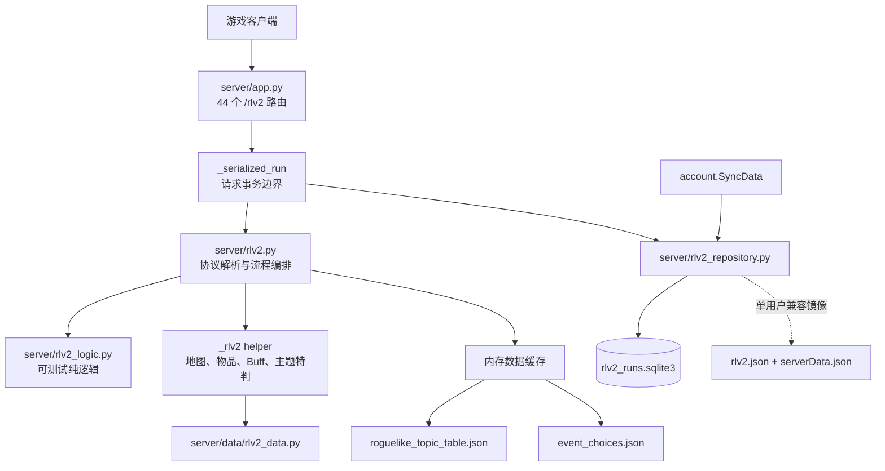
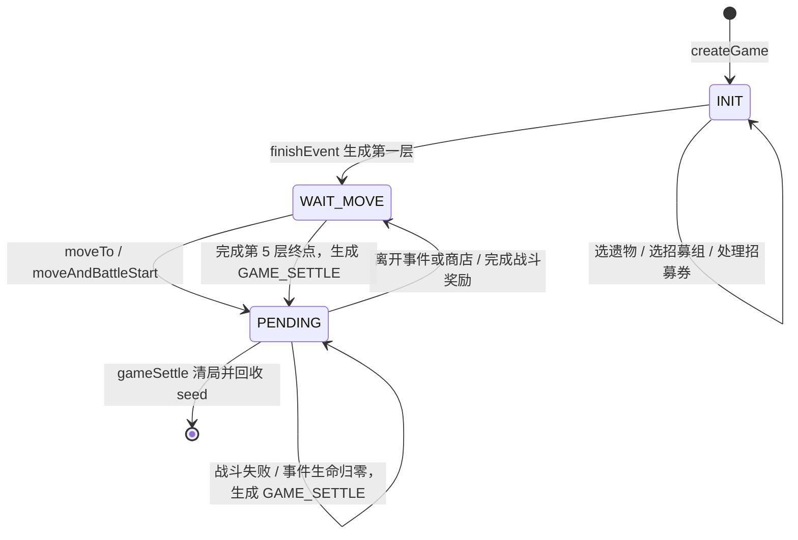

# Roguelike（RLV2）当前架构与逻辑分析

> 审计日期：2026-07-14  
> 审计基线：`main@753eab6` 加当前工作区中尚未提交的战斗基础收益修改  
> 客户端基准：国服 `2.7.51`，资源版本 `26-07-10`  
> 范围：`rogue_1` 至 `rogue_5` 的 `/rlv2/*` 主链路；旧 `/activity/roguelike/*` 不属于本文主流程。

## 1. 结论摘要

当前 RLV2 可以概括为“事务存储已经成形，公共玩法能够形成基础闭环，但规则还原和专题机制仍处于半成品状态”。

- 存储层已经从共享 JSON 升级为 SQLite：当前局、主随机种子和种子历史在同一事务提交，具备 UID 隔离能力、revision、自定义 CAS、Legacy 导入和单用户兼容镜像。
- 当前配置仍是 `enabled=false` 的单用户模式，所有请求实际映射到 `__single_user__`；“支持多用户”不等于“当前已启用多用户”。
- Flask 共注册 46 个 `/rlv2/*` POST 接口，其中 21 个有实际状态逻辑，24 个返回空对象和 HTTP 202，另 1 个 BP 奖励接口返回空对象和 HTTP 200。也就是说，25/46 的注册接口目前没有业务行为。
- 开局、初始选择、招募、地图移动、事件、商店、战斗、奖励和跨层已能组成五层基础流程；状态转移仍直接散落在 handler 中，没有独立的领域状态机。
- RO1、RO2 的人工事件数据包含实际效果；RO3、RO4、RO5 的事件入口和 choice 效果当前全部为空，运行时基本只会出现“离开”。
- 地图是通用权重随机图，不是按主题和结局模板生成；五主题专属模块大多只初始化了客户端需要的数据外形。
- 终局已具备 `finishGame -> GAME_SETTLE -> gameSettle` 的零奖励安全清局闭环；外层记录、原版分数、BP 和奖励仍未实现。

当前最影响可玩性的缺口不是 SQLite，而是终局协议、地图 Boss 节点、战斗零生命判定、空事件数据和大量空接口。

## 2. 系统边界与组件



| 层次 | 文件 | 当前职责 | 评价 |
| --- | --- | --- | --- |
| HTTP 路由 | [server/app.py](../server/app.py) | 直接用 `app.add_url_rule()` 注册接口 | 没有 Blueprint 或 app factory；已实现与占位接口混在一起 |
| 请求事务 | [server/rlv2.py](../server/rlv2.py) 的 `_serialized_run` | 解析存储 UID、打开事务、按响应状态提交或回滚 | 边界明确，但只覆盖 19 个实际 handler |
| 流程编排 | [server/rlv2.py](../server/rlv2.py) | 解析协议、修改状态、生成地图、事件/商店/战斗结算 | 超过 2700 行，协议、领域规则和主题特判高度耦合 |
| 纯逻辑 | [server/rlv2_logic.py](../server/rlv2_logic.py) | 开局表、等级、数值 delta、招募、生命结算、基础战斗收益 | 无 Flask 和磁盘 I/O，是目前最清晰的拆分边界 |
| 仓储 | [server/rlv2_repository.py](../server/rlv2_repository.py) | UID、SQLite 事务、revision、Legacy 迁移和镜像 | 已成为当前局的唯一真源 |
| 同步读模型 | [server/account.py](../server/account.py) | `SyncData` 时从仓储覆盖 `user.rlv2.current` | 只隔离 RLV2 当前局，账号其余数据仍是共享 JSON |
| 客户端规则表 | `data/excel/roguelike_topic_table.json` | 主题、模式、关卡、物品、券、难度、结局等 | 约 15 MB 且被 Git 忽略，干净克隆不能独立复现 |
| 人工规则 | [event_choices.json](../data/rlv2/event_choices.json)、[rlv2_data.py](../server/data/rlv2_data.py) | 事件效果、RO2/RO3 部分难度 Buff | 覆盖不均；RO3-5 事件效果为空，RO4/5 难度表为空 |
| 测试 | [tests](../tests) | 纯逻辑、仓储、事务装饰器 | 缺真实 Flask 接口和完整一局状态机测试 |

`server/rlUtils.py` 和 `config/rlv2Config.json` 中还保留一套旧地图实现，但当前 RLV2 主链路没有调用它；实际地图入口是 `_rlv2.getMap_new()`。

## 3. 启动与数据加载

`server/app.py` 作为模块级 Flask 应用直接启动，顺序为：

1. 读取 `config/config.json`。
2. 通过 `load_data()` 加载 `event_choices.json` 等自定义数据。
3. 当前 `useMemoryCache=true`，因此预载 `data/excel` 下的全部 JSON。
4. 启动后台事件循环并计算角色星级缓存。
5. 使用 Flask 自带 threaded server 监听端口。

运行依赖使用者自行提供的 `data/excel`。RLV2 的主要运行时数据如下：

| 数据 | 用途 | 当前限制 |
| --- | --- | --- |
| `roguelike_topic_table.json` | 初始化、关卡、物品、招募券、难度、结局、模块声明 | 客户端表不包含完整服务端随机权重；文件未纳入版本控制 |
| `event_choices.json` | 场景入口列表和 choice 效果解释 | 没有楼层、结局、藏品、一次性标记等完整 eligibility |
| `server/data/rlv2_data.py` | 手工难度 Buff | RO1、RO4、RO5 为空；来源和表结构没有启动期校验 |
| `data/user/rlv2Settings.json` | 少量特殊关卡楼层映射 | 只覆盖 24 个关卡，其他关卡依赖 ID 字符串解析 |
| `data/user/rlv2UserSettings.json` | 旧版 `allChars` 模式的初始干员列表 | 当前主流程不再读取该列表 |

当前有效配置需要特别注意：

- `config/multiUserConfig.json` 为 `enabled=false`，运行在单用户 sentinel 模式。
- `config/config.json` 中 `rlv2Config.allChars=true`。
- `data/user/rlv2UserSettings.json` 当前仍保留 `char_4080_lin`，但不会再将其注入开局队伍。

默认流程现在只把 `allChars` 用于招募候选池和实例编号；普通开局队伍为空，选择招募组后按表生成初始招募券。

## 4. 请求、事务与持久化

### 4.1 已实现接口的请求链路

1. Flask 将请求分派到 `server/rlv2.py` 的 handler。
2. `_serialized_run` 懒加载进程级 `RunRepository`，根据配置解析存储 UID。
3. Repository 执行 `BEGIN IMMEDIATE`，读取该 UID 的 `run`、`revision`、`rlv2_seed` 和 `seed_list`。
4. 活动事务放入 `ContextVar`；`shopAction -> buyGoods/leaveShop` 之类的嵌套 handler 复用同一事务。
5. handler 直接修改事务中的可变字典；`_persist_run()` 只替换事务快照，不立即写磁盘。
6. 返回状态 `<400` 时提交并让 revision 加一；状态 `>=400` 或抛出异常时回滚。
7. 单用户模式下，SQLite 提交成功后再更新旧 JSON 兼容镜像。
8. 成功响应通常通过 `playerDataDelta.modified.rlv2.current` 返回修改后的状态。

这里实际是“所有 `<400` 状态提交”，不只是 2xx。若以后 handler 返回无法被 `_response_status()` 识别的 Flask `Response`，错误响应存在被当作 200 提交的风险。

### 4.2 SQLite 模型

当前 schema 只有两张表：

```text
roguelike_runs(
  uid PRIMARY KEY,
  revision,
  run_json,
  rlv2_seed_json,
  seed_list_json,
  updated_at_ns
)

repository_metadata(key PRIMARY KEY, value)
```

- SQLite 开启 WAL、`synchronous=FULL`、外键和 10 秒 busy timeout。
- `BEGIN IMMEDIATE` 在整个 handler 执行期持有数据库级写锁，因此不同 UID 的写请求也会串行。
- `save(expected_revision=...)` 支持 CAS；生产 HTTP handler 走持锁事务，不要求客户端携带 base revision。
- revision 不下发客户端，也没有 `run_id`、动作日志或请求幂等键。网络重试仍可能重复扣费或发奖。
- SQLite 原生异常没有统一包装为 `RunRepositoryError`，锁超时或磁盘错误可能返回 500 而不是 503。

### 4.3 单用户、多用户与 Legacy

| 模式 | UID 行为 | Legacy 行为 |
| --- | --- | --- |
| 当前单用户模式 | 忽略请求头，统一使用 `__single_user__` | 首次自动导入旧 JSON；提交后默认镜像回 JSON |
| 可选多用户模式 | 要求合法 `Uid` 请求头，以 UID 隔离 run 和 seed | 不自动猜测旧档归属；需要显式调用 `migrate_legacy(uid)` |

多用户能力仍有三个边界：

- `Uid` 只是客户端声明的存储键，没有 secret/session 认证，知道其他 UID 即可冒用。
- 干员模板和初始干员设置仍从全局 `data/user/user.json`、`rlv2UserSettings.json` 读取。
- `migrate_legacy()` 没有 CLI、管理接口或启动期运维流程，目前只有测试直接调用。

`account.SyncData()` 会按当前存储身份把仓储中的 run 合并到 `user.rlv2.current`，解决了重登继续局的问题；它没有把整个用户存档改造成多用户存储。

## 5. 局内状态模型

`rlv2CreateGame()` 建立一个无类型约束的嵌套字典：

| 分区 | 主要字段 | 当前用途 |
| --- | --- | --- |
| `game` | `theme/mode/predefined/eGrade/equivalentGrade/start` | 一局的固定上下文 |
| `player` | `state/property/cursor/trace/pending/status/toEnding/chgEnding` | 状态、资源、位置和待处理动作 |
| `map` | `zones -> nodes -> next` | 只保存当前层地图、访问状态和路线 |
| `troop` | `chars/expedition/...` | 已招募干员；外派字段大多尚未使用 |
| `inventory` | `relic/recruit/trap/consumable/exploreTool` | 藏品、券、工具和通用资源账本 |
| `buff` | `tmpHP/capsule/squadBuff` | 公共战斗 Buff 和少量 RO1 状态 |
| `module` | `san/dice/totem/.../sky` | 五主题专属状态外形 |
| `record` | `brief` | 创建后没有实际消费者 |

`player.state` 实际只有四种值；战斗并没有单独的 `BATTLE` state，而是用 `PENDING + pending[0].type` 表示。

| `player.state` | 预期活动 pending |
| --- | --- |
| `INIT` | `GAME_INIT_RELIC`、`GAME_INIT_RECRUIT_SET`、`GAME_INIT_RECRUIT`，或压在其上的 `RECRUIT` |
| `WAIT_MOVE` | `pending=[]`，允许地图移动 |
| `PENDING` | `SCENE/SHOP/BATTLE/BATTLE_REWARD/RECRUIT/DRAW_COPPER/GAME_SETTLE` |
| `NONE` | 枚举默认值；当前无活动局实际使用 `player=null` |

`GAME_OVER` 不在客户端 `PlayerRoguelikePlayerState` 枚举中；旧服务产生的该值只作为历史存档输入，读取时立即迁移，绝不能再下发给客户端。

`pending[0]` 是活动项，但这个列表同时具有队列和栈的语义：初始化项用 `append/extend` 顺序排队，嵌套招募、事件战斗和奖励用 `insert(0)` 压栈。状态不变量没有集中校验，各 handler 自己检查和 `pop(0)`；`finishBattleReward()`、`leaveShop()` 甚至直接清空全部 pending。

## 6. 一局游戏的主流程



### 6.1 创建与初始选择

- `createGame` 根据 `theme/mode/modeGrade/predefinedId` 精确选择客户端表中的 init 行，建立初始属性、默认结局、pending 和主题模块。
- 月队会从全局账号干员模板中选择预置干员；缺少指定模板时返回 400。
- 挑战模式若客户端表没有初始招募组、且服务器没有预置阵容，会明确拒绝创建。
- `createGame` 不检查是否已有活动局，可以直接覆盖旧进度；若旧 seed 尚未清理，新局会复用同一 seed。
- 初始 pending 顺序是遗物、招募组、招募处理。招募券状态为 `0 未激活 -> 1 激活 -> 2 已处理`。
- 当前 `allChars=true` 时不会生成初始招募券，而是注入用户设置中的干员。

### 6.2 开始探索与移动

- `finishEvent` 实际承担“完成初始化并开始探索”的职责：将游标设为第 1 层、生成地图，并转入 `WAIT_MOVE`。
- RO5 会先压入 `DRAW_COPPER`，确认后才允许移动。
- 普通移动要求 `WAIT_MOVE`、目标未访问且存在邻接边；战斗节点必须走 `moveAndBattleStart`，非战斗节点走 `moveTo`。
- 带 `key` 的纵向边会消耗主题表定义的路线资源；RO3 的视野值可以和 consumable 账本共同支付。

### 6.3 事件

- 进入事件节点时，从当前主题的全部 `enter` 场景中随机选择，没有先按楼层、结局、藏品、一次性标记或主题模块过滤。
- 当前资源只用于判断 choice 是否可支付；支付后可修改属性、模块、consumable、物品，跳转下一场景或压入事件战斗。
- 事件奖励支持字符串模式匹配、候选列表和数量式抽取；随机数由主 seed、主题、楼层、位置和 choice 派生。
- RO1、RO2 具备实际事件效果；RO3、RO4、RO5 的人工数据目前没有可执行效果。

事件数据快照：

| 主题 | enter 场景 | 有非空入口的场景 | choice 效果行 | 实际情况 |
| --- | ---: | ---: | ---: | --- |
| RO1 | 38 | 38 | 107 | 可执行，但缺完整资格过滤 |
| RO2 | 46 | 46 | 176 | 可执行，含部分灯火/骰子/钥匙变化 |
| RO3 | 111 | 0 | 923 个空占位 | 运行时基本只有 `choice_leave` |
| RO4 | 68 | 0 | 357 个空占位 | 运行时基本只有 `choice_leave` |
| RO5 | 114 | 0 | 1788 个空占位 | 运行时基本只有 `choice_leave` |

### 6.4 商店

- 商店固定生成 1 张全职业券，加最多 5 个从主题 archive 中抽取的藏品/工具。
- 价格只按物品类型和稀有度使用固定常量；没有真实商品池权重、折扣、投资或主题商店规则。
- 购买会校验源石锭、扣款、删除库存并发放物品；购买招募券时立即压入招募流程。
- 返回结构会显示银行，但存取能力为 false，对应接口仍是空 202。

### 6.5 战斗与奖励

- 战斗开始会校验地图关卡和路线，将状态设为 `PENDING` 并压入 `BATTLE`。
- 下发内容包括藏品/分队/难度 Buff、固定的 `chestCnt=100`、`goldTrapCnt=10` 和箱子信息；RO2 还会生成 100 个骰点及骰子 token。
- 战斗完成依赖客户端加密结果中的 `completeState` 和 `leftHp`。`PASS(2)` 与 `COMPLETE(3)` 都是胜利，结算生命/护盾并生成 `BATTLE_REWARD`；只有 `FAIL(1)` 进入 `GAME_SETTLE`。响应补齐 `CommonFinishBattleResponse` 字段，已应用的成功或放弃结果重试时返回当前状态 200，不重复发奖。
- 当前工作区已改为按 `theme + zone + normal/emergency` 表结算基础经验和源石锭，并校验主题表中的 `expItemId/goldItemId`。经验立即入账，源石锭作为待领取奖励发放。
- 当前奖励仍固定附带一张全职业券；Boss 节点没有独立基础经验/源石锭规则，只会得到固定券。
- `chooseBattleReward` 已校验 `index + sub` 并防止同一项重复领取；`finishBattleReward` 不要求所有奖励已领取，可以直接跳过剩余奖励。
- 成功结果若上报 `leftHp=0`，生命会被结算为 0，但 handler 仍创建奖励，没有转入终局结算。

### 6.6 跨层、终局与放弃

- 完成带 `zone_end` 的节点后，第 1 至第 4 层会丢弃当前地图并生成下一层。
- 第 5 层结束后直接写入成功的 `PENDING + GAME_SETTLE + content.result`；`toEnding` 只用于结果字段，没有驱动 Boss、隐藏层或结局改线。
- `finishGame` 对已经生成的 `GAME_SETTLE` 幂等返回；`gameSettle` 返回对象型零分和字段完整的零外层收益结构，并原子清空 run、回收 seed。历史 `GAME_OVER` 或旧版错误 pending 会在登录/动作入口先迁移。该流程没有实现原版外层记录、BP 或奖励。
- `giveUpGame` 可在任意状态清空 run，把当前 seed 插入 `seed_list` 头部并清空活动 seed。
- 自然胜负在 `gameSettle` 时回收 seed；`seed_list` 没有消费、去重或长度限制。

## 7. 地图生成与随机数

### 7.1 当前地图算法

`_rlv2.getMap_new(theme, seed, zone)` 的主要步骤是：

1. 用 `Random(f"{seed}_{zone}_{theme}")` 建立本层 RNG。
2. 普通层按 `zone * 2` 建列，列高由 seed、zone、列号的 MD5 取模决定。
3. 按通用硬编码权重抽普通战斗、紧急战斗、事件和各主题特殊节点。
4. 普通/紧急节点按 `roN_n_zone_*`、`roN_e_zone_*` 前缀抽关卡。
5. 第一层补固定末端结构；第 2/4 层末端为事件类节点，第 3/5 层末端为 Boss。
6. RO3 额外执行紧急节点数量约束。
7. 随机生成相邻列边和少量同列纵向边，再修复没有入边或出边的节点。

该算法能保证基本横向连通，但不是原版拓扑生成器：

- 节点类型、列数、列高和连线概率是通用常量，没有主题/模式/结局拓扑模板。
- 第二层以后权重可能抽到 `type=4`，但普通列只给 `type=1/2` 填充 stage，会生成无法正常开战的无关卡 Boss 节点。
- 终点 Boss 从所有 `roN_b_[1-9]` 中抽取，与楼层、模式和 `toEnding` 无关联，也排除了带后缀及编号 10 的变体。
- 流程固定第 5 层结束，表中的第 6/7 层和隐藏结局无法进入。
- 所有特殊节点最终大多退化为通用 `SCENE`，没有各自的领域行为。

### 7.2 随机数模型

主 seed 随 run 一起持久化，但没有统一 RNG 流或抽取序号。各功能通过字符串上下文重新构造 `Random`：

| 场景 | 派生上下文 |
| --- | --- |
| 地图 | `seed + zone + theme` |
| 进入事件/商店 | `seed + zone + theme + 坐标` |
| 选择事件 | `seed + theme + zone + position + choice` |
| 战斗箱子/骰点 | `seed + theme + stage + cursor` |
| 初始招募组 | `seed + theme + recruitGroup` |
| RO5 通宝 | initial/redraw 专用字符串和重抽次数 |

优点是同一上下文大体可复现；限制是：

- `getMap_new()` 返回的 seed 原样不变，跨层并没有推进主 RNG 状态。
- `prepare_recruit_candidates()` 选择免费候选时使用无 seed 的 `Random()`，同一主 seed 不能完全重放。
- 状态包含运行时时间戳，也不具备字节级确定性。
- 缺少 generation trace，无法解释某次抽取为何命中某节点或奖励。

## 8. 公共规则与物品解释器

`server/rlv2_logic.py` 当前负责：

- 精确选择主题、模式、难度和 predefined 初始化行。
- 选择普通或特殊等级表，处理累计经验、多级升级和属性增长。
- 稀疏嵌套数值增减、支付能力检查和资源边界 clamp。
- 初始招募组转券、月队预置干员、职业/稀有度过滤、招募与进阶希望消耗。
- 生命/护盾/RO1 临时生命结算。
- RO3 紧急节点数量约束。
- 当前工作区新增的五主题逐层普通/紧急战斗基础收益。

物品和 Buff 解释仍主要位于 `_rlv2`：

- 支持 HP、HP 上限、源石锭、希望、编队上限、经验、护盾、灯火、骰子次数和视野等通用资源。
- 支持招募/进阶/自定义券、藏品、主动工具和探索工具入库。
- 藏品即时副作用只专门解释 `level_life_point_add`、`immediate_reward` 和 `item_cover_set`。
- 其他战斗 Buff 会在开战时下发，但大量非战斗、专题物品效果会退化为 `inventory.consumable`，没有驱动主题模块。
- `hasItem()` 可以跨多个藏品实例累计数量，但 `remove_item()` 删除第一个匹配项后立即返回，复数堆叠支付可能少扣。

## 9. 五主题完成度

| 主题 | 客户端模块 | 当前已有行为 | 主要缺口 |
| --- | --- | --- | --- |
| RO1 傀影 | 无专属 module | 临时生命参与战斗；事件效果可执行 | `capsule` 只有字段，没有剧目触发、消费和换层重置 |
| RO2 水月 | `SANCHECK/DICE` | 初始化灯火 100、骰子 1；部分事件可修改资源；战斗生成骰点/token | 不消费骰子次数，`diceChoice` 为空，排异反应和完整灯火检定缺失 |
| RO3 萨米 | `CHAOS/TOTEMBUFF/VISION` | 初始化坍缩、密文板、视野；视野可支付路线 | 事件全空；坍缩、密文板、抗干扰和结局链没有状态转移 |
| RO4 萨卡兹 | `FRAGMENT/DISASTER/NODE_UPGRADE` | 初始化构想、灾厄、节点升级；开局后计算一次干员负荷 | 后续招募不重算负荷；携带、灵感、时代、节点重掷/升级均未实现 |
| RO5 界园 | `COPPER/WRATH/CANDLE/SKY` | 生成 7 枚通宝、展示 3 枚；支持确认和免费重抽 | 事件全空；重抽不扣费且不更新 pending；烛火为 `None`，怒意、天域、鎏金、留券均缺失 |

## 10. HTTP 接口完成度

### 10.1 有实际逻辑的 19 个接口

| 分组 | 接口 |
| --- | --- |
| 生命周期 | `/rlv2/createGame`、`/rlv2/giveUpGame` |
| 初始化/事件/招募 | `chooseInitialRelic`、`selectChoice`、`chooseInitialRecruitSet`、`activeRecruitTicket`、`recruitChar`、`closeRecruitTicket`、`finishEvent` |
| 移动/战斗 | `moveAndBattleStart`、`battleFinish`、`finishBattleReward`、`moveTo` |
| 商店/奖励 | `buyGoods`、`leaveShop`、`shopAction`、`chooseBattleReward` |
| RO5 通宝 | `copper/confirmDraw`、`copper/redraw` |

这些接口均由 `_serialized_run` 包装。

### 10.2 注册但无状态行为的 25 个接口

24 个接口直接返回 `{}`, HTTP 202：

```text
bankPut, bankWithdraw,
nodeMission/confirm, nodeMission/giveUp, nodeMission/closeTip,
readEndingChange, rerollNode, upgradeNode,
getTicketAssistList, recruitAssistChar,
diceChoice, sacrificeChoice, copper/gild,
expeditionChoice, game/confirmExpeditonReturn,
shopBattleStart, refreshShop, setPinned,
confirmZoneReward, confirmTraderReturn,
useStashedTicket, stashRecruitTicket,
specialZone/leave, chooseInitialExploreTool
```

`/rlv2/battlePass/getReward` 返回空 `{}` 和 HTTP 200。这 25 个 handler 没有事务装饰器，也不校验 UID 或局状态。

另外：

- `/rlv2/finishGame` 与 `/rlv2/gameSettle` 已注册，但当前只实现安全清局，不计算外层收益。
- `rlv2SetTroopCarry()` 存在但没有路由，客户端请求相应能力会得到 404。
- `rlv2getRewardgetReward()` 是未注册的重复占位函数。
- 旧 `/activity/roguelike/*` 另有 6 个空 202 接口，不应与 RLV2 主链路混用。

## 11. 测试现状

当前共有 59 个 RLV2 测试：

| 测试组 | 数量 | 覆盖 |
| --- | ---: | --- |
| `test_rlv2_logic.py` | 30 | 开局表、等级、招募、生命、战斗收益、协议迁移、事件 delta、RO3 紧急节点 |
| `test_rlv2_repository.py` | 11 | UID、双用户隔离、CAS、线程并发、原子提交、Legacy 迁移 |
| `test_rlv2_transactions.py` | 18 | give-up/终局隔离、PASS/COMPLETE 胜利、战斗与结算重试、奖励事务、4xx 回滚、嵌套提交、缺 UID |

审计开始时，`main@753eab6` 的 38 项基线测试全部通过。当前工作区扩展到 59 项，逻辑、仓储与事务测试已全部通过；另用运行中服务验证了历史非法状态的登录迁移、结构化结算响应、清局和 seed 回收。

当前测试缺口：

- 没有真实 Flask app、路由和 `SyncData` 端到端测试；事务测试使用伪造模块。
- 没有从 `createGame` 到自然终局的完整状态机测试；失败战斗到安全清局已有事务和 Flask 请求级验证。
- 没有 `getMap_new()` 的批量固定种子可达性、无空 stage 和分布性质测试。
- 没有 RO1/2 完整事件链、商店、战斗奖励、RO5 通宝的 handler 测试。
- 除 `battleFinish` 与 `gameSettle` 外，仍没有系统性的动作重试幂等测试；也缺多进程锁竞争、busy timeout、数据库/镜像故障注入、损坏记录和 schema 升级测试。
- 自动化 workflow 只更新版本配置，没有运行测试；逻辑测试又依赖被 Git 忽略的客户端表。

## 12. 主要风险与建议顺序

### P0：修复基础闭环

1. 通过同版本真实协议补齐 `/rlv2/gameSettle` 的外层记录、分数、BP 和奖励；保留当前已验证的清局与 seed 生命周期。
2. 禁止生成没有 stage 的 `type=4` 节点，并按主题、楼层和结局选择 Boss。
3. 战斗成功后若生命为 0，必须先进入失败终态，不能继续发放奖励。
4. 对 25 个空接口明确区分“客户端允许忽略”和“主流程必需”；关键能力在实现前不应静默返回成功。
5. 同步完成当前战斗收益测试，覆盖五主题、各层、普通/紧急边界和资源 ID 校验。

### P1：收敛状态机与一致性

1. 引入独立 `RunEngine`，用 `RunState + Command -> RunState + DomainEvents` 统一校验 `state/pending/run_id/revision`。
2. 避免 handler 任意 `pop(0)` 或清空 pending；建立显式的状态转移矩阵。
3. 为动作增加 request ID 和结果幂等记录，防止网络重试重复扣费或发奖。
4. `createGame` 增加活动局门禁，或要求显式覆盖；新局必须明确创建/轮换 seed。
5. 建立统一 RNG 服务和抽取序号，保存 generation trace，消除无 seed 的随机路径。

### P2：规则还原

1. 先按主题、楼层、模式和结局实现地图模板、节点池和事件 eligibility，再调随机权重。
2. 将战斗收益扩展到 Boss、特殊变体、紧急额外掉落和藏品乘区。
3. 完成 RO1/2 现有事件条件，并为 RO3/4/5 填充可验证的离线效果数据。
4. 把专题资源从通用 consumable 账本迁移到各自 module 的状态机。
5. 按 `BattleCompleted/ZoneEntered/ItemGranted` 等领域事件驱动五主题机制，避免继续在 HTTP handler 中叠加特判。

### P3：工程化

1. 将 `rlv2.py` 拆为 API adapter、RunEngine、MapGenerator、RewardResolver、EventResolver 和 ThemeModule。
2. 为客户端表建立版本标识、启动期 schema 校验和交叉引用校验。
3. 完善 Repository 的 SQLite 异常映射、schema migration、镜像告警和运维修复入口。
4. 若启用多用户，把账号干员、RLV2 用户设置和 SyncData 主存档纳入同一身份体系，并使用认证后的 UID。

## 13. 验证与审计边界

本次结论来自：

- 对路由、handler、纯逻辑、仓储、配置和数据文件的静态追踪。
- 对当前客户端表和事件数据的结构化计数。
- 对仓储、事务和原有逻辑测试的实际执行。
- 对工作区未提交战斗收益修改的差异复核。

本次没有真实客户端抓包，也没有执行从登录到终局的完整 Flask/客户端联调。因此，本文可以作为当前代码架构和实现完成度的基线，但不能替代同版本真实协议样本对字段和原版概率的验证。
